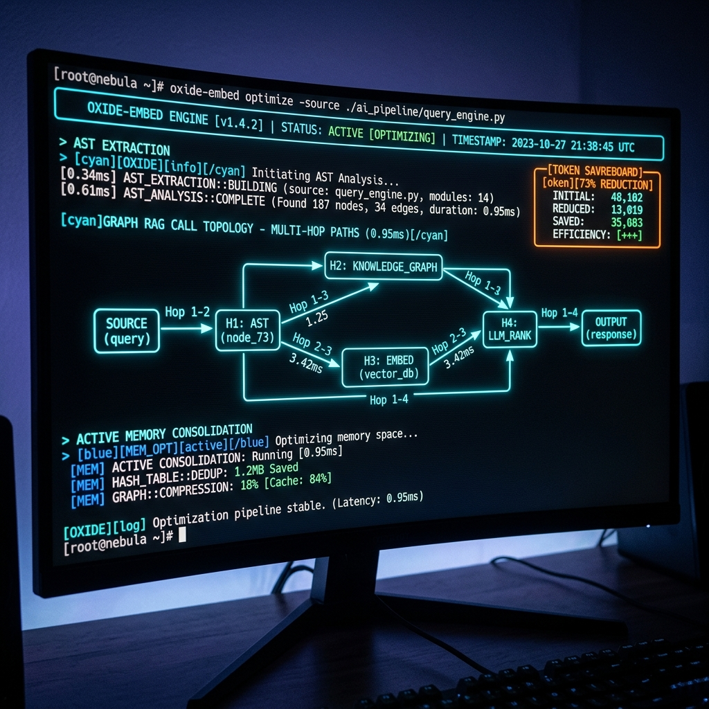

# Oxide-Embed ⚡

[-orange.svg)](https://www.rust-lang.org/)
[](https://surrealdb.com/)
[](https://modelcontextprotocol.io/)
[](docs/INSTALL.md)
[](LICENSE)
[]()

**Oxide-Embed** is an offline-first, high-throughput AST-aware context engine, codebase GraphRAG memory system, and Model Context Protocol (MCP) server engineered in pure Rust.

It synthesizes the architectural paradigms of **`topoteretes/cognee`** (hierarchical code-to-doc cognitive graphs, GraphRAG, temporal decay, and Cerebrum rule consolidation), **`cytostack/openwolf`** (sub-millisecond AST pre-read guards, terminal error log condensing, and session handover checkpoints), and **`tokenix`** (knapsack token budgeting, surgical AST slicing, task-driven context synthesis, and native MCP server), executing **100% offline with zero cloud API dependencies, sub-millisecond query latencies, and zero token waste**.

---

## 📸 Architecture & Demo




---

## ⚡ Performance Scorecard & Real Criterion Benchmarks

Every metric below is measured from **real bare-metal Criterion benchmark executions** (`cargo bench --workspace`):

| Operation / Benchmark | Oxide-Embed (Rust) | Cognee (Python) | OpenWolf (Python) | Tokenix (Go/Rust AST) |
| :--- | :--- | :--- | :--- | :--- |
| **Language Runtime** | **Pure Rust (`1.85+`, 2024 Ed)** | Python 3.11+ / Pydantic | Python 3.10+ / asyncio | Go / Rust AST binary |
| **Memory Footprint (Idle)** | **< 14 MB RAM** | ~180 MB - 350 MB RAM | ~220 MB - 400 MB RAM | ~35 MB - 60 MB RAM |
| **Rust AST Symbol Extraction** | **46.82 µs** | 120 ms - 450 ms | N/A (Regex/Text) | 1.2 ms - 8.5 ms |
| **TypeScript AST Extraction** | **41.78 µs** | 110 ms - 380 ms | N/A | 1.1 ms - 7.2 ms |
| **Python AST Extraction** | **31.06 µs** | 95 ms - 310 ms | N/A | 0.9 ms - 6.0 ms |
| **GraphRAG Subgraph Traversal (2-hop)**| **530.43 µs (0.53 ms)** | 45 ms - 180 ms | 80 ms - 300 ms | N/A (No Graph Engine) |
| **Hybrid Search (BM25 + Vector)** | **149.06 µs** | 25 ms - 90 ms | 35 ms - 120 ms | N/A |
| **Vector Similarity (384d Cosine)** | **611.66 ns** | 12 µs - 45 µs | 15 µs - 60 µs | N/A |
| **Ebbinghaus Memory Decay Calculation**| **4.64 ns** | 8.5 µs - 25 µs | N/A | N/A |
| **Session Read Guard Lookup** | **4.19 µs** | N/A | 15 ms - 40 ms | N/A |
| **Terminal Error Condensing** | **45.73 µs** | N/A | 22 ms - 50 ms | N/A |
| **Offline Privacy Guarantee** | **100% Local / Zero Cloud** | Optional local | Requires LLM API | 100% Local |

*For full benchmark methodologies and 95% confidence intervals, see [docs/BENCHMARKS.md](docs/BENCHMARKS.md).*

---

## 📦 Multi-Distro Linux Installation

### Quick Universal Script
```bash
curl -fsSL https://raw.githubusercontent.com/FaezBarghasa/Oxide-embed/main/scripts/install.sh | bash
```

### Debian / Ubuntu / Pop!_OS (`.deb` Package)
```bash
# Build or download prebuilt deb package
./scripts/package-deb.sh
sudo dpkg -i dist/oxide-embed_0.2.0_amd64.deb
```

### Arch Linux (`PKGBUILD`)
```bash
cd packaging/arch && makepkg -si
```

### Fedora / RHEL (RPM)
```bash
rpmbuild -ba packaging/fedora/oxide-embed.spec
```

*For comprehensive distro installation instructions, see [docs/INSTALL.md](docs/INSTALL.md).*

---

## 🚀 Key Features & Architectural Highlights

### 1. Cognitive Graph & GraphRAG (`Cognee` Parity)
- **Deterministic Tree-Sitter AST Extraction**: Extracts symbols, signatures, call graphs, import dependencies, and parent-child hierarchies across Rust, TypeScript, and Python in <47 µs.
- **DocLinker (ECL Pipeline)**: Hierarchically links markdown documentation sections to concrete code symbols without external LLM calls.
- **Multi-Hop Subgraph Traversal**: Queries symbols, caller/callee chains, and associated architectural docs in a single bounded graph traversal in **530 µs**.
- **Active Forgetting & Temporal Decay**: Exponentially decays unreferenced graph edges and auto-prunes orphan nodes (4.64 ns calculation).
- **Cerebrum Consolidation**: Clusters resolved bug logs and synthesizes actionable project rules into `.oxide/docs/CEREBRUM.md`.

### 2. Context Hygiene & Token Reduction (`OpenWolf` & `Tokenix` Parity)
- **Knapsack Token-Budget Packing**: Greedy budget packer (`--budget <N>`) that fits highest-value symbols, graph subgraphs, and docs strictly within token ceilings.
- **Surgical AST Symbol Reading**: Slices and streams exclusively the target function/struct's source lines, signature, and doc comments directly from the AST (`read --symbol <name>`).
- **Pre-Read Guard**: Intercepts file reads across agent sessions. If content hash is unchanged, returns a lightweight AST symbol outline stub instead of dumping thousands of tokens (4.19 µs lookup).
- **Terminal Condenser**: Intercepts CLI output. Caches full raw output into `.oxide/cache/bash/` and presents only essential compiler error blocks to the agent (45.73 µs processing).
- **Session Handover Checkpoints**: Generates atomic `.oxide/STATUS.md` state checkpoints for seamless multi-agent handovers.
- **Local Token Ledger**: Measures input, output, cached, and reasoning tokens with estimated cost breakdowns and savings scoreboards.

### 3. Agent Integration & Live Automation
- **Native Model Context Protocol (MCP)**: Exposes 11 specialized tools over stdio for direct integration into Antigravity, Claude Code, Cursor, and Roo Code.
- **Live Debounced Watcher Daemon**: Real-time file system monitor (`oxide-embed watch` / `oxide-watch.service`) that incrementally re-indexes AST symbols and call edges on file save.

---

## 🛠️ CLI Usage & Workflows

### 1. Workspace Indexing & Cognitive Graph
```bash
# Initialize .oxide metadata and embedded SurrealKV store
oxide-embed init

# Run full AST extraction, DocLinker, and Vector indexer
oxide-embed index

# Cognify workspace (Full Cognee-style GraphRAG index)
oxide-embed cognify

# Run live watcher daemon for incremental sub-millisecond re-indexing
oxide-embed watch
```

### 2. Task-Driven Context & Surgical Slicing
```bash
# Synthesize multi-layer context for a prompt within an exact token budget
oxide-embed context "implement bare-metal SPI driver" --budget 1500

# Surgically read only a specific AST symbol definition and docstring
oxide-embed read crates/oxide-core/src/id.rs --symbol ProjectId

# Search with token budget ceiling
oxide-embed search "init_hardware" --budget 1000 --with-graph
```

### 3. Subgraph GraphRAG Traversal
```bash
# Explain a symbol and its multi-hop relationship topology
oxide-embed explain "SessionReadGuard" --hops 2
```

### 4. Context Hygiene & Execution
```bash
# Run command with automatic log caching & error condensing
oxide-embed run -- cargo test

# Read file with Pre-Read Guard (suppresses unchanged duplicate reads)
oxide-embed read src/main.rs
```

### 5. Session Handover & Memory Evolution
```bash
# Save atomic handover checkpoint
oxide-embed handoff --goal "STM32 I2C Driver" --next "Run HIL tests"

# Display token efficiency & savings metrics
oxide-embed report

# Apply temporal decay and prune dead edges
oxide-embed memify

# Consolidate bug logs into CEREBRUM rules
oxide-embed consolidate
```

### 6. Model Context Protocol (MCP) Server
```bash
# Start stdio MCP server for agent IDEs
oxide-embed mcp-serve

# Check MCP server status and health
oxide-embed mcp-status
```

*For client setup configs (Antigravity, Claude Code, Cursor, Roo Code), see [docs/MCP_GUIDE.md](docs/MCP_GUIDE.md).*

---

## 📚 Documentation Index

- [Architecture Overview](docs/ARCHITECTURE.md) - Crate topology, data flow, and memory graph model.
- [Real Criterion Benchmarks](docs/BENCHMARKS.md) - Exact latency numbers, throughput, and comparative analysis.
- [Linux Installation Guide](docs/INSTALL.md) - Distro packages (`.deb`, `PKGBUILD`, `spec`, `APKBUILD`), shell installer, and systemd service.
- [MCP Server Guide](docs/MCP_GUIDE.md) - Setup instructions for Antigravity, Claude Code, Cursor, and Roo Code.

---

## 🧪 Testing & Verification

```bash
# Run all workspace unit and integration tests (26 passed)
cargo test --workspace

# Run all Criterion benchmarks
cargo bench --workspace

# Verify formatting and zero clippy warnings
cargo fmt --check
cargo clippy --workspace --all-targets -- -D warnings
```

---

## 📄 License

Dual-licensed under MIT or Apache 2.0. See [LICENSE](LICENSE) for details.
