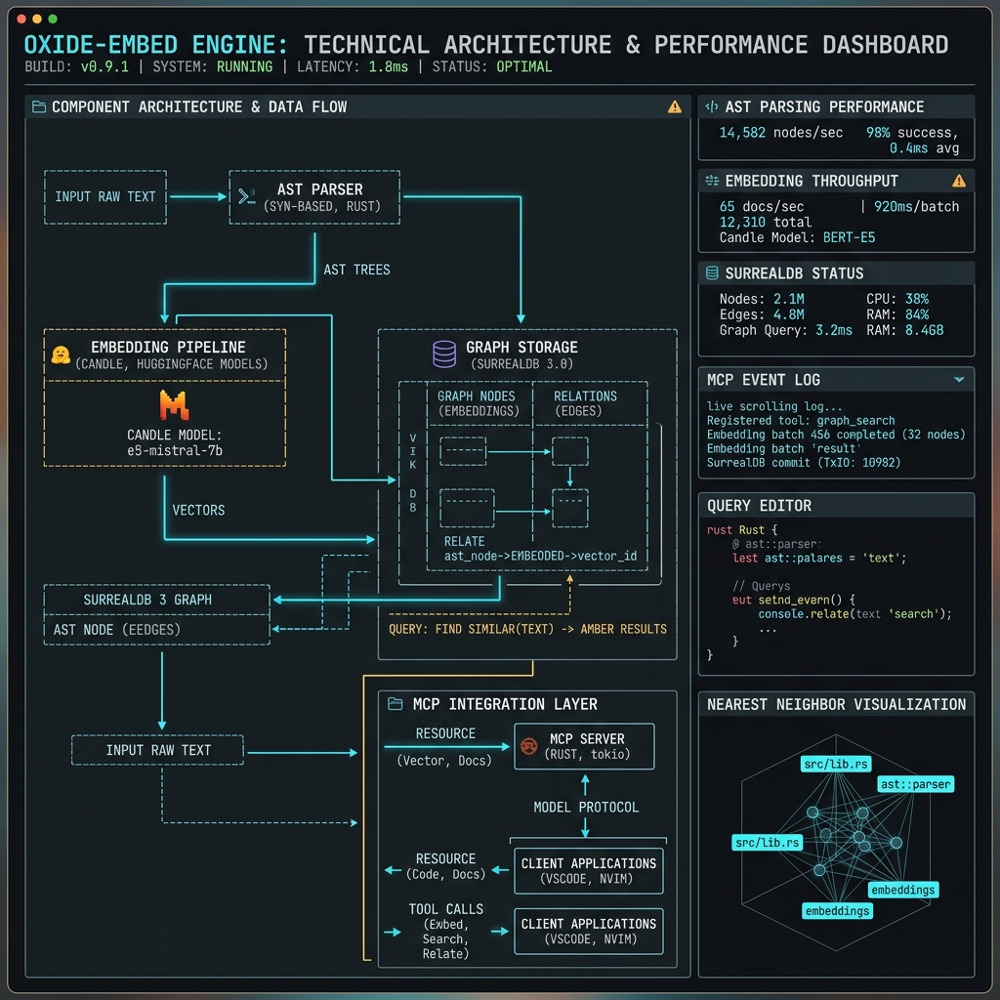
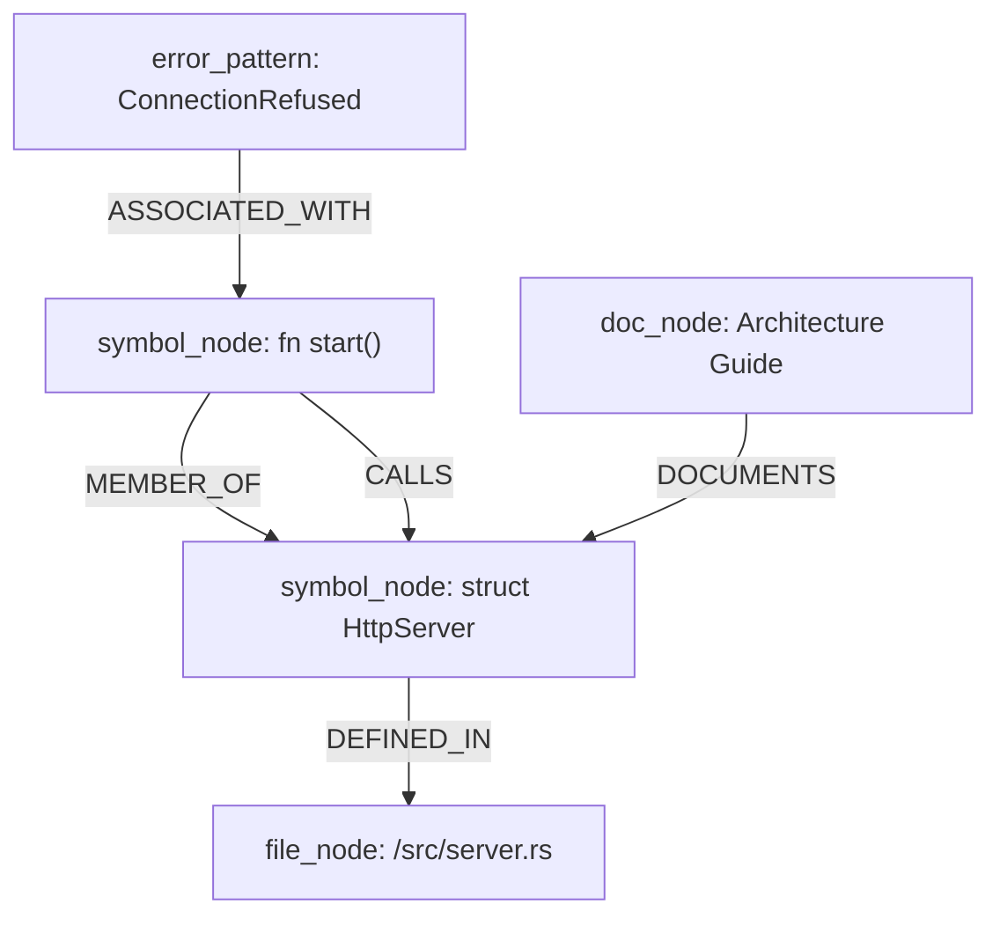
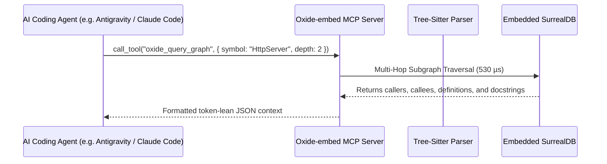

# Oxide-embed System Architecture

Oxide-embed is architected as an offline-first, high-throughput context engine, GraphRAG memory layer, and Model Context Protocol (MCP) server for local AI coding agents.



---

## 1. Core Architecture Principles

1. **Pure Rust Runtime**: Zero Python interpreter overhead, zero GIL contention, and minimal static binary size (<14 MB).
2. **100% Offline Privacy**: Zero external API calls, zero telemetry, local embedding models (ONNX Runtime `EmbeddingGemma-300M`, Candle `Qwen3-Embedding-0.6B`, and Candle BERT), and embedded SurrealDB.
3. **Sub-millisecond AST Parsing**: Native C tree-sitter bindings for Rust, TypeScript, Python, C, and C++ with incremental caching.
4. **Graph-Enhanced RAG (GraphRAG)**: Full code topology modeling (`CALLS`, `EXTENDS`, `DEFINED_IN`, `IMPORTS`) with multi-hop subgraph traversals in <0.6 ms.
5. **Context Hygiene & Token Efficiency**: Ebbinghaus memory decay, token burn ledgers, session pre-read guards, and intelligent error condensing.

---

## 2. Workspace Crate Topology

```
Oxide-embed/
├── crates/
│   ├── oxide-core/        # Domain entities, IDs, Hashing, Token Ledger, Decay Logic, Storage Path Resolution
│   ├── oxide-parser/      # Tree-sitter AST, Chunking, Outline, Markdown Anatomy, Call/Import Extraction
│   ├── oxide-ml/          # Embedding Engines (ONNX Gemma-300M, Candle Qwen3-0.6B, Candle BERT 384d)
│   ├── oxide-db/          # Embedded SurrealDB, Hybrid Lexical/Vector Search, GraphRAG Traversal
│   └── oxide-cli/         # CLI Subcommands, MCP Server, Background File Watcher Daemon
├── packaging/             # Distro packaging (Debian, Arch, Fedora, Alpine, Systemd)
├── scripts/               # Automation scripts (install.sh, package-deb.sh, build-dist.sh)
└── docs/                  # Technical documentation and benchmark reports
```

### A. `oxide-core`
- **Canonical Storage Resolution (`resolve_db_path`)**: Dynamically resolves `.oxide/project.db` (SurrealKV) with legacy fallbacks.
- **Session & Project IDs**: UUIDv7 time-ordered identifiers (1.51 µs derivation).
- **Session Read Guard**: LRU & hash-based context deduplication filter (4.19 µs lookup).
- **Terminal Condenser**: Compresses compiler error outputs and strips ANSI formatting (45.73 µs).
- **Token Ledger & Ebbinghaus Decay**: Tracks multi-agent prompt token consumption and applies memory decay curves (4.64 ns calculation).
- **Knapsack Token Budget Packer**: Greedy knapsack allocation strictly enforcing token limits on prompt contexts.

### B. `oxide-parser`
- **Tree-sitter AST Extractor**: Native bindings for Rust (46.8 µs), TypeScript (41.7 µs), Python (31.0 µs), C, and C++.
- **Call & Import Edge Extraction**: Discovers function calls, method invocations, and module import paths.
- **Smart Symbol Chunking**: Chunks source files strictly along AST node boundaries (functions, structs, classes) instead of arbitrary token splits.
- **Anatomy & Docstrings**: Extracts Markdown documentation sections and links them bi-directionally to code symbols.

### C. `oxide-ml`
- **ONNX Gemma Embedder (`OnnxGemmaEmbedder`)**: Hardware-accelerated 768d embeddings using `EmbeddingGemma-300M` and ONNX Runtime.
- **Candle Qwen Embedder (`CandleQwenEmbedder`)**: High-accuracy 1024d embeddings using `Qwen3-Embedding-0.6B` and `candle-core`.
- **Candle BERT Embedder (`CandleBertEmbedder`)**: Lightweight 384d embeddings using `bge-small-en-v1.5`.
- **Vector Math**: Hardware-accelerated cosine similarity (611 ns) and K-Means code cluster distillation.

### D. `oxide-db`
- **Embedded SurrealDB Engine**: Native in-process database with zero client-server network hops.
- **GraphRAG Subgraph Traversal**: Multi-hop edge traversals (`CALLS`, `DEFINED_IN`, `IMPORTS`, `DOCUMENTS`) executing in **530 µs**.
- **Hybrid Search**: Combines BM25 lexical keyword matching with KNN vector search in **149 µs**.

### E. `oxide-cli`
- **CLI Subcommands**: `init`, `index`, `cognify`, `callers`, `callees`, `impact`, `tokenmap`, `context`, `search`, `explain`, `run`, `read`, `handoff`, `report`, `memify`, `consolidate`, `install-hook`, `watch`, `mcp`.
- **MCP Server**: Implements 11 Model Context Protocol tools for AI coding assistants (Antigravity, Claude Code, Cursor, Roo Code).
- **File Watcher**: `notify`-based incremental re-indexing daemon with systemd user service integration.

---

## 3. GraphRAG Topology Model



---

## 4. MCP Server Integration Flow


