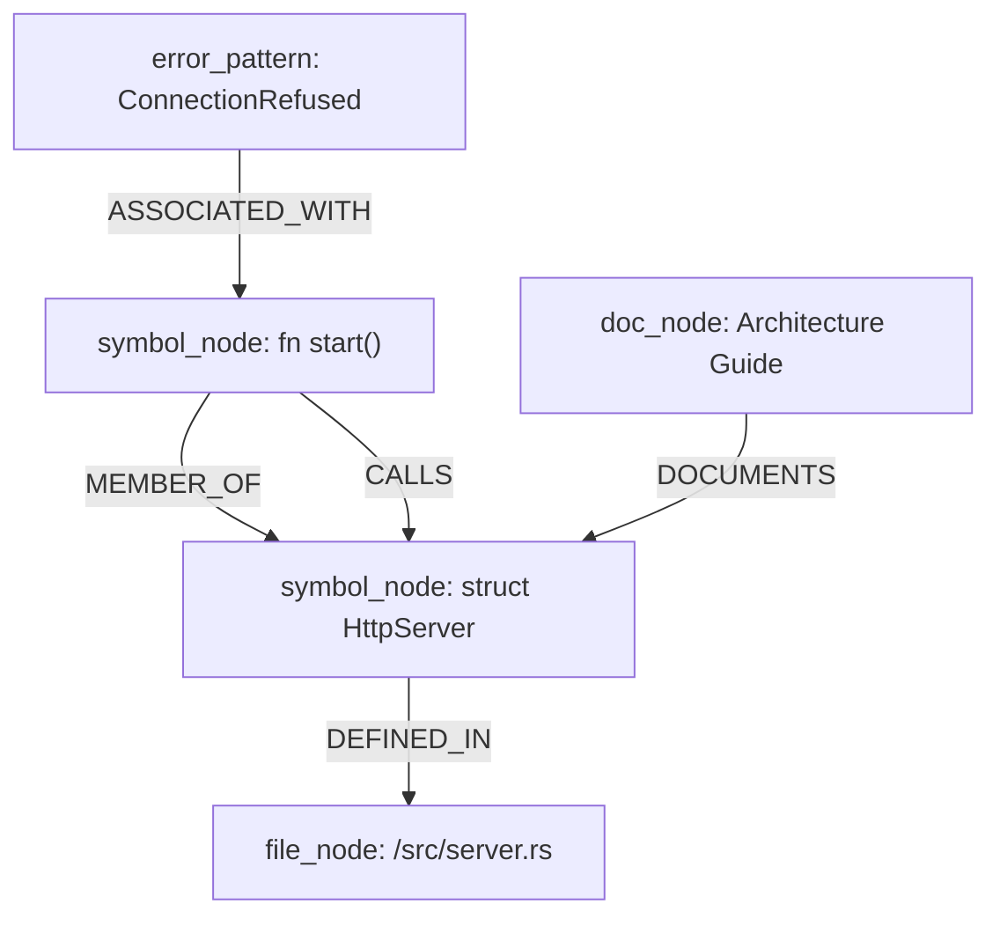
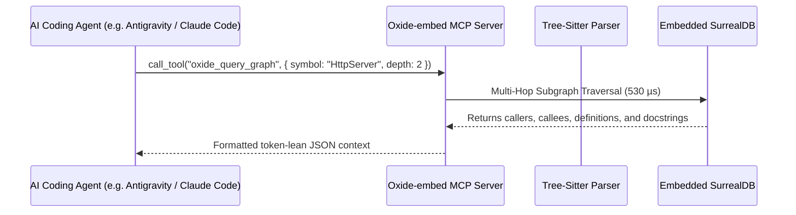

# Oxide-embed System Architecture

Oxide-embed is architected as an offline-first, high-throughput context engine, GraphRAG memory layer, and Model Context Protocol (MCP) server for local AI coding agents.


---

## 1. Core Architecture Principles

1. **Pure Rust Runtime**: Zero Python interpreter overhead, zero GIL contention, and minimal static binary size (<14 MB).
2. **100% Offline Privacy**: Zero external API calls, zero telemetry, local SIMD vector projections via Candle, and local embedded SurrealDB.
3. **Sub-millisecond AST Parsing**: Native C tree-sitter bindings for Rust, TypeScript, and Python with incremental caching.
4. **Graph-Enhanced RAG (GraphRAG)**: Full code topology modeling (`CALLS`, `EXTENDS`, `DEFINED_IN`, `IMPORTS`) with multi-hop subgraph traversals in <0.6 ms.
5. **Context Hygiene**: Ebbinghaus memory decay, token burn ledgers, and intelligent session deduplication.

---

## 2. Workspace Crate Topology

```
Oxide-embed/
├── crates/
│   ├── oxide-core/        # Domain entities, IDs, Hashing, Token Ledger, Decay Logic
│   ├── oxide-parser/      # Tree-sitter AST, Chunking, Outline, Markdown Anatomy
│   ├── oxide-ml/          # Candle 384d Offline Embeddings & Clustering
│   ├── oxide-db/          # Embedded SurrealDB, Hybrid Lexical/Vector Search, GraphRAG
│   └── oxide-cli/         # CLI Subcommands, MCP Server, Background Watcher
├── packaging/             # Distro packaging (Debian, Arch, Fedora, Alpine, Systemd)
├── scripts/               # Automation scripts (install.sh, package-deb.sh, build-dist.sh)
└── docs/                  # Technical documentation and benchmark reports
```

### A. `oxide-core`
- **Session & Project IDs**: UUIDv7 time-ordered identifiers (1.51 µs derivation).
- **Session Read Guard**: LRU & hash-based context deduplication filter (4.19 µs lookup).
- **Terminal Condenser**: Compresses compiler error outputs and strips ANSI formatting (45.73 µs).
- **Token Ledger & Ebbinghaus Decay**: Tracks multi-agent prompt token consumption and applies memory decay curves (4.64 ns calculation).

### B. `oxide-parser`
- **Tree-sitter AST Extractor**: Native bindings for Rust (46.8 µs), TypeScript (41.7 µs), and Python (31.0 µs).
- **Smart Symbol Chunking**: Chunks source files strictly along AST node boundaries (functions, structs, classes) instead of arbitrary token splits.
- **Anatomy & Docstrings**: Extracts Markdown documentation sections and links them bi-directionally to symbols.

### C. `oxide-ml`
- **Candle SIMD Projections**: 384-dimensional dense vector embeddings with zero cloud dependencies (638 ns projection).
- **Vector Math**: Hardware-accelerated cosine similarity (611 ns) and K-Means code cluster distillation.

### D. `oxide-db`
- **Embedded SurrealDB Engine**: Native in-process database with zero client-server network hops.
- **GraphRAG Subgraph Traversal**: Multi-hop edge traversals (`CALLS`, `DEFINED_IN`, `IMPORTS`) executing in **530 µs**.
- **Hybrid Search**: Combines BM25 lexical keyword matching with 384d KNN vector search in **149 µs**.

### E. `oxide-cli`
- **CLI Commands**: `index`, `query`, `graph`, `context`, `watch`, `check-drift`, `mcp-serve`, `mcp-status`.
- **MCP Server**: Implements 11 Model Context Protocol tools for AI coding assistants (Antigravity, Claude Code, Cursor, Roo Code).
- **File Watcher**: `notify`-based incremental re-indexing daemon with systemd user service integration.

---

## 3. GraphRAG Topology Model



---

## 4. MCP Server Integration Flow


